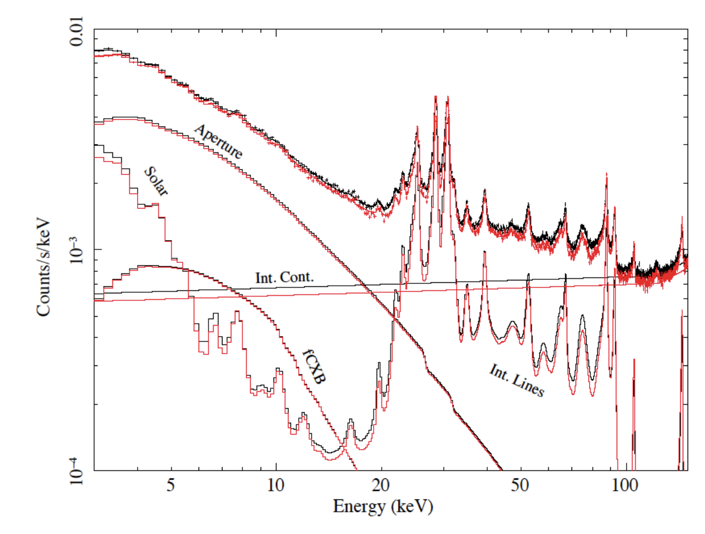
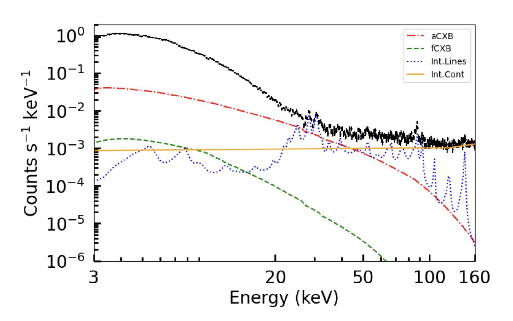
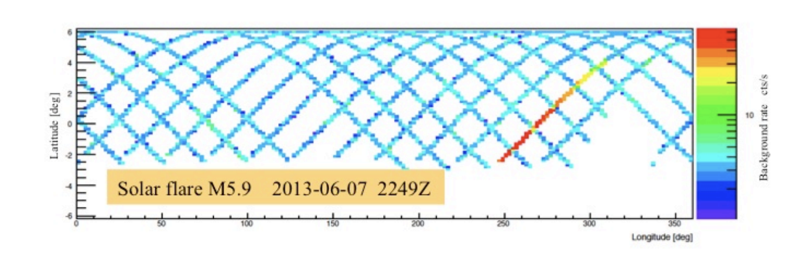
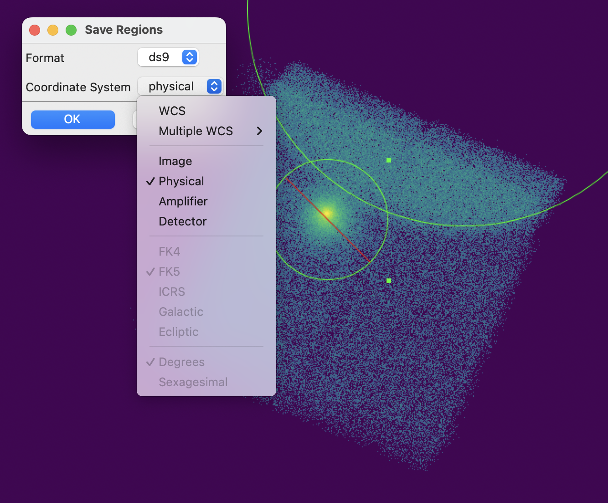
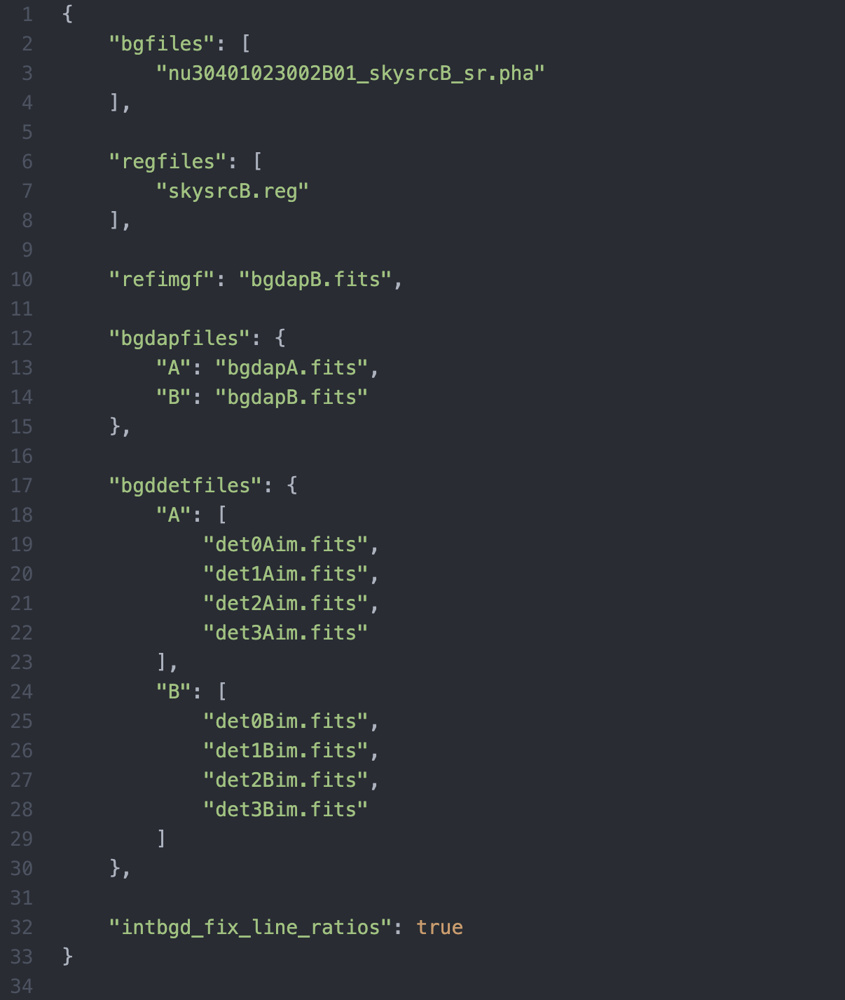
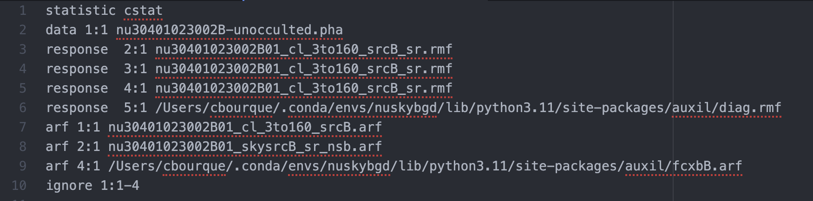
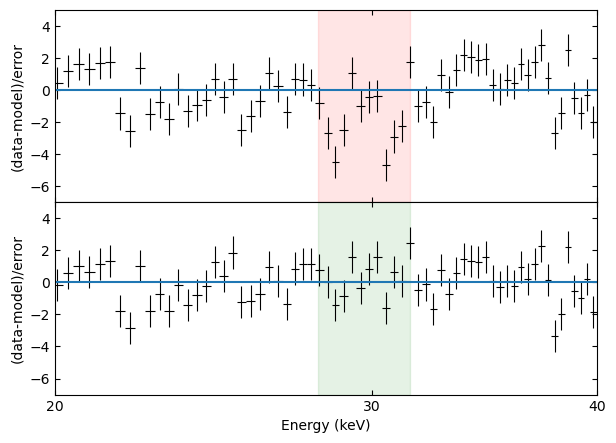

# Utilizing NuSTAR's Stray Light

The Nuclear Spectroscopic Telescope Array (NuSTAR) includes two mirrors and two detectors known as focal plane modules (FPMs). Since the path between the mirrors and FPMs is not shrouded, bright X-ray sources slightly off-axis can contaminate another focused observation when their light is directly collimated onto the detectors. This is known as "stray light" (Madsen+2017, Grefenstette+2020, Ludlam+2022).

Two quirks make processing stray light a non-trivial process compared to a normal, focused NuSTAR observation: custom response files are required to handle the spectrum, and the fact that there is no way to simply subtract a background. These problems are addressed by a suite of stray light utilities in [nustar-gen-utils](github.com/NuSTAR/nustar-gen-utils) and by the [nuskybgd](github.com/NuSTAR/nuskybgd-py) model by Wik+2014, respectively.

This document is intended to be a practical guide for how to handle stray light data in accordance with what is currently understood to be best-practice by CJB. The procedure described follows that of many recent stray light papers including Li+2025, Li+2026, Bourque+Submitted.

Scripts referenced in this document and attached to this repository are not entirely my own, but include code written by other collaborators such as MCB, RML, BWG, and possibly others. I have attempted to attribute credit where it is rightly due in the comments of each respective script.

## Extracting Stray Light Products

Stray light spectra (and light curves) are produced utilizing the stray light wrappers in `nustar-gen-utils`, and generally take three steps:
1. Create a detector image for determining use in all later steps; use this to select the stray light region,
2. Generate spectra, response files, and light curves,
3. Re-set the spectrum header to correctly indicate the stray light area.

For each of these steps, a fairly generic Python script is included which queries the user for the ObsID and a few other details, and then either directly creates products or returns a script for to run.

Much of the philosophy behind *why* these stray light products scripts do what they do is omitted in this document; instead, it is attached for completeness while mainly just supplementing the, likely more interesting, explanation of `nuskybgd`.

It is assumed that all of the packaged scripts will be run from the same directory which holds the top-level observation folder, e.g.:

/some-directory/  
-> get_detim.py  
-> get_products.py  
-> get_arfareakey.py  
-> 30401023002/  
 |-> event_cl/  
 |-> event_uf/

Some level of control over this can be exerted by modifying the `evdir` argument in most `nustar-gen-utils` functions.

In its simplest form, generate stray light products by first getting the detector image:

>python get_detim.py

and provide the ObsID. Open the detector image in `ds9` and select the stray light region, saving it in detector coordinates to `evdir`. NB: the region name will be appended to all products, so a simple name like `srcA.reg` will prevent later products from inheriting unwieldy file names.

With the region made, the bulk of the products can be generated with

>python get_products.py

which will query for ObsID, region file name, module (A or B), and desired light curve bin length. This will provide the user with scripts for generating light curves and spectra, which can be run from the terminal. NB: I have found that these scripts sometimes require modifying the `nuproducts` call to specify an extended source. Without this, as far as I can tell, `nuproducts` attempts to take some shortcuts that would otherwise only work for much smaller source regions.

Finally, re-set the ARF area header information by running

>python get_arfareakey.py

and providing the ObsID, region name, and module.

With this done, you should now have source-region products. Modeling the background of the spectrum is described in the following section.

## About the `nuskybgd` Background

`nuskybgd` models the background of a NuSTAR observation by accounting for each of the four major components which are expected to contribute counts to an observation beyond just incident source photons. This is shown in the following figures, from Wik+2014 and Li+2025. *fCXB* and *aCXB* are the cosmic X-ray background as seen in focused or unfocused light, respectively. *Int. Lines* is the set of instrument activation lines, and *Int. Cont.* is the instrument continuum, which is roughly a constant gain.

Wik+2014's model also accounts for a *solar* component of the background. This is substantially more challenging to constrain, and it is best to simply avoid any situation which would otherwise require it. In general, this is achieved by manually checking to ensure no elevated solar activity is contaminating your observation. Ground trace plots can be useful in showing when this occurs (see below, from the [NuSTAR Observatory Guide](https://heasarc.gsfc.nasa.gov/docs/nustar/nustar_obsguide.pdf), Fig. 29), although per BWG: "the background plots ... are actually hard to interpret when you've got SL in the FoV."

The remainder of this guide assumes no solar activity impacts your observation. If there seems to be any, filter it out.

## Generating the `nuskybgd` Background

 Effective use of `nuskybgd` involved generating a background model which correctly describes the physical sky background in the stray light pattern region. As such, it operates on a different set of data products than were produced with the stray light wrappers. Instead, `nuskybgd` takes sky region products generated from a region defined in physical, sky coordinates.

 Begin by producing a region equivalent to the stray light region from earlier, but this time save the region in `fk5` format. Regions for both detectors are required for `nuskybgd` to run even if stray light is only present on one detector, so make sure to generate them both.

 

 Now generate products for this sky region. Assuming you saved the physical regions as `skysrcA.reg` and `skysrcB.reg` to `/event_cl/`, you can just run

 >python nuskyprep.py

 and then run the output script to make the spectrum, in much the same fashion as the above stray light products step.

 Now use `nuskybgd` on these sky-source products to generate a preliminary background model:

Create instrument maps:
 >nuskybgd mkinstrmap nu30401023002A01_cl.evt  
 >nuskybgd mkinstrmap nu30401023002B01_cl.evt

Create aspect histogram images:
 >nuskybgd aspecthist nu30401023002A_det1.fits gtifile=nu30401023002A01_gti.fits out=aspecthistA.fits  
 >nuskybgd aspecthist nu30401023002B_det1.fits gtifile=nu30401023002B01_gti.fits out=aspecthistB.fits

Now make a background directory inside `/event_cl/` and begin working from here:
 >mkdir bgd  
 >cd bgd

Generate background aperture images:
 >nuskybgd projbgd refimg=../nu30401023002A01_cl_3to20keV.fits out=bgdapA.fits mod=A det=1234 chipmap=../newinstrmapA.fits aspect=../aspecthistA.fits  
 >nuskybgd projbgd refimg=../nu30401023002B01_cl_3to20keV.fits out=bgdapB.fits mod=B det=1234 chipmap=../newinstrmapB.fits aspect=../aspecthistB.fits

The `nuskyprep` script generated products in `/event_cl/`, so copy them into the `/bgd/` directory for use now:
>cp ../\*.pha ../\*.rmf ../\*.reg .  

For `nuskybgd` to make and fit the background model, a json pointing to relevant spectra, region, and other instrument assessment files is required. An example of the formatting expected in this json can always be summoned by running
>nuskybgd fit --help

Although for our purposes generating a background model for only one detector, only a smaller portion of these values will be filled in:

With this saved, the preliminary background fit can be produced with:
>nuskybgd fit FPMB.json savefile=fpmb >& fitb.log

which returns a loadable Xspec instance `fpmb.xcm`. Since all Xspec instances are packaged with a sternly written warning about not modifying the file, I like make a copy to work with in case I accidentally do something to break the code.

Directly out of `nuskybgd`, the `.xcm` file is set to load in the sky region spectrum and response files, which is *not* what we want for stray light analysis. Instead, bring the stray light spectrum, ARF, and RMF to the same location as the `nuskybgd` products, and change out all `skysrc` products for your stray light products, as well as making sure to load in the stray light ARF as `arf 1:1`. (As a bonus, re-set the top line to use `cstat` instead of `chi`, since this will likely be better for your data)

In total, your new `.xcm` file should begin with imports that look something like:

You can now open this in `Xspec` and fit the background.

## Fitting the `nuskybgd` Background

When you load in your `.xcm` instance created above, there will be four models applied to the data, named `apbgd`, `fcxb`, `intn`, and `intbgd`, corresponding to the earlier identified components of NuSTAR's background. `fcxb` and `apbgd` are the cosmic X-ray background; we presume that `nuskybgd` did a good job estimating these, and freeze them exactly as they were produced.

>freeze fcxb:\*     
>freeze apbgd:\*  

Additionally, turn off the solar components, which are baked into the `intbgd` model:

>newpar intbgd:4 0 0  
>newpar intbgd:7 0 0   
>newpar intbgd:10 0 0  
>newpar intbgd:13 0 0  

Now, you can constrain the instrument continuum background. To do this, notice only the spectral channels above 120 keV:

>notice 120.-160.  
>ignore \*\*-120.  

and fit the model. Now you can freeze the instrument continuum model

>freeze intn:4

Finally, treatment of the instrument lines component will depend on your source's spectrum. For spectrally soft sources, where minimal source photons are expected at high energies ($\gtrsim 70$ keV) you simply fit the instrument lines model between 120-160 keV,

>notice 80.-120.  
>fit  
>freeze intbgd:16  

**However** if your source is spectrally hard and sufficiently bright, freezing the instrumental lines based on the fit above 80 keV will artificially increase the normalizations needed to correctly model the background. This is because physical source photons from stray light *can* still be detected above 80 keV (Mastroserio+2022), and if enough are present this instrument lines model will attempt to fit *both* the detector background *and* the source continuum.

 As an example, this can be seen in source 4U 1700-377. The figure below shows residuals plot for a complete fit (source and background model). In the top panel, the `intbgd` model was constrained to fit the range of 80-120 keV; however, when the full spectrum is fit and analyzed, it is clear that prominent detector lines below this range are set to be far too strong.

 In the bottom panel, the detector lines model is *not* frozen, and instead fit alongside the source spectrum. This prevents it from fitting at too high a normalization, and indeed we see that the lower energy instrument lines are no longer producing unphysical residuals. This procedure is followed by Bourque+Submitted.

 As a note, additional caution is encouraged when building the source model in this manner, since blindly fitting continua and the instrument background may produce unexpected degeneracies or otherwise complicate this process. It is likely the most straightforward to begin with a reasonable source continuum model (such as one inspired by a focused observation of the same source, and approximately normalized) before running a full `fit` for the first time.

## Bonus: Plotting

As a bonus, plots of spectra directly out of `Xspec` are often quite unwieldy with so many components as is necessary for handling stray light and `nuskybgd`. I personally find it easiest to just produce a `QDP` file from Xspec and handle the visualization in Python.

>iplot  
>wdata my_spectrum.qdp

To this end, I have attached a Python script `qdp_handler.py` with a function `sl_qdp()` can take in the raw QDP file from `iplot` and return a `Numpy` array with all of the components included in the Xspec plot window. An example Jupyter notebook utilizing this script is also included.
